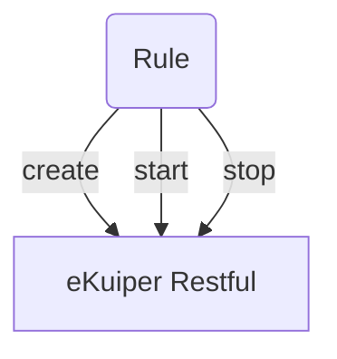
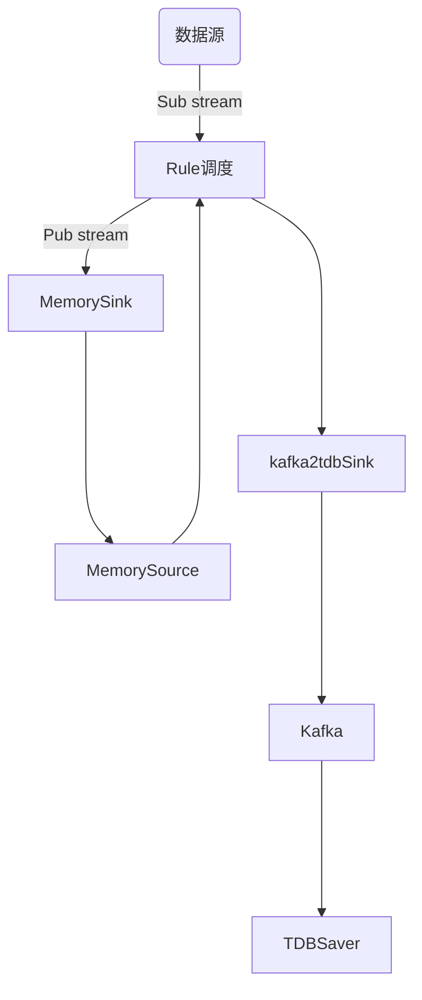

# 流程图

## rule管理

> 1. JavaSDK 调用 eKuiper Restful 接口，对 Rule 进行语法组织, 发布, 管理
> 2. Rule中包含 SQL 语句, 流处理逻辑, 其中的SQL语句有约定好的常量字段, 与流处理中的自定义Sink进行通知. 

## 流处理

> 1. MemorySink 包含数据清洗、数据修正、数据过滤, 根据Rule中的SQL语句中约定好的常量字段进行逻辑处理
> 2. kafka2tdbSink 包含与 MemorySink 同样逻辑的数据清洗、数据修正、数据过滤

